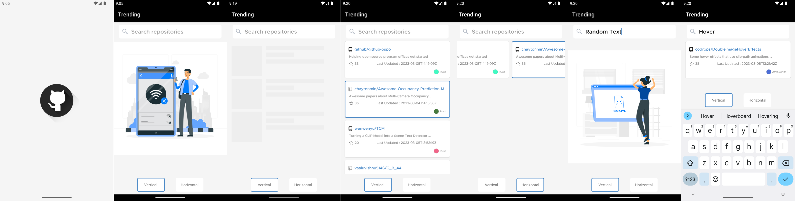

# GithubDemo

<b>PLEASE GENERATE AND USE YOUR OWN GITHUB TOKEN, GITHUB REVOKES TOKEN THE TOKEN IF SHARED PUBLICALLY ON REPOSITORY</b>
<b>Update token at path "com/jaysinghtalreja/githubdemo/utils/Constants.kt" </b>
<b>At Field API_KEY = "YourTokenHere"</b>
 

